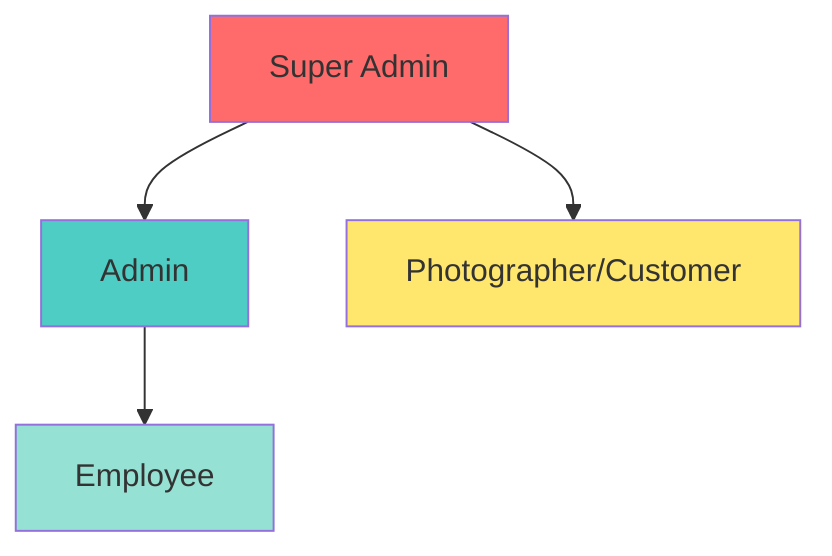
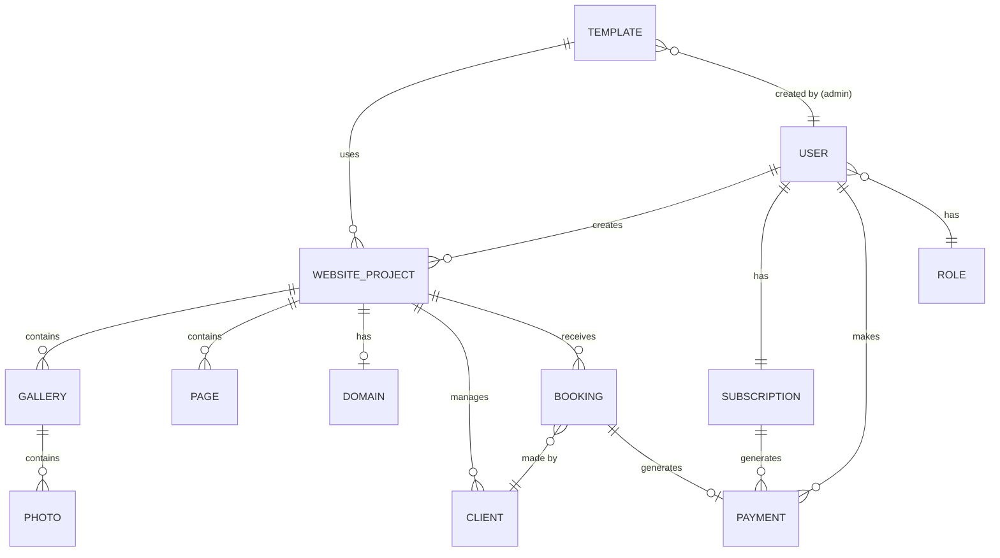
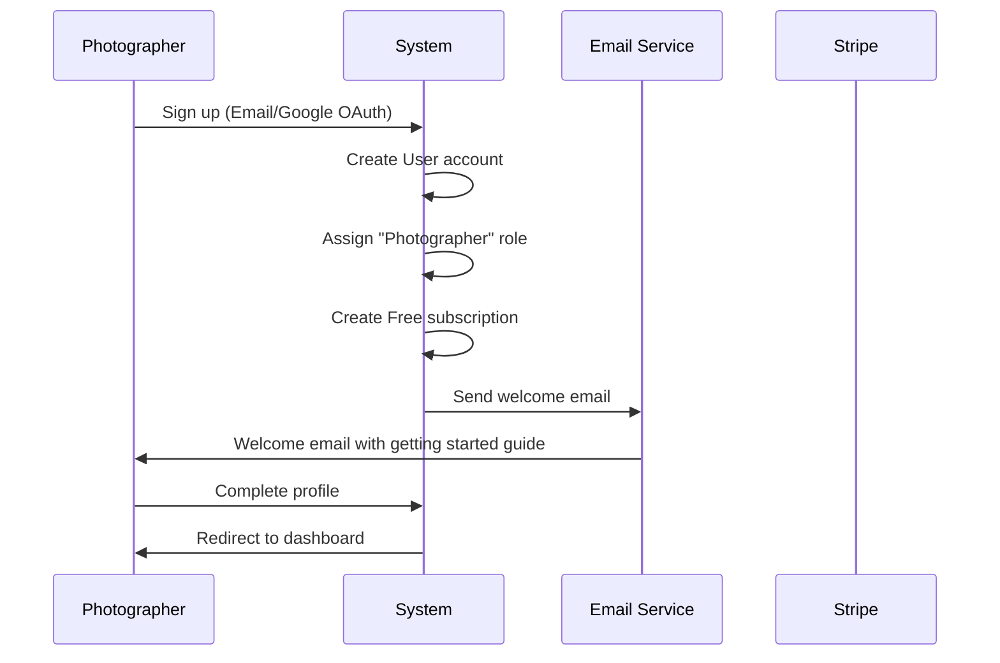
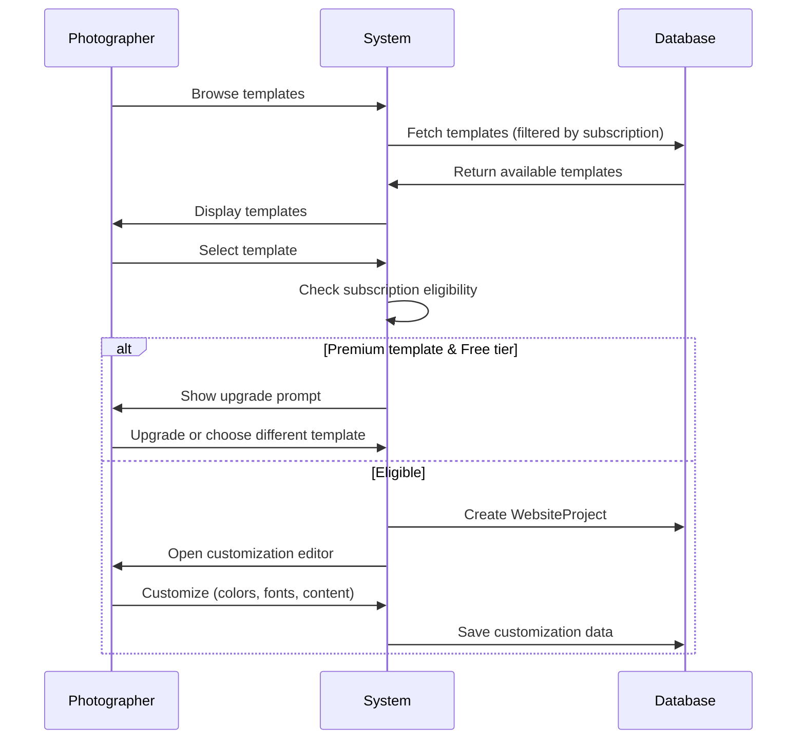
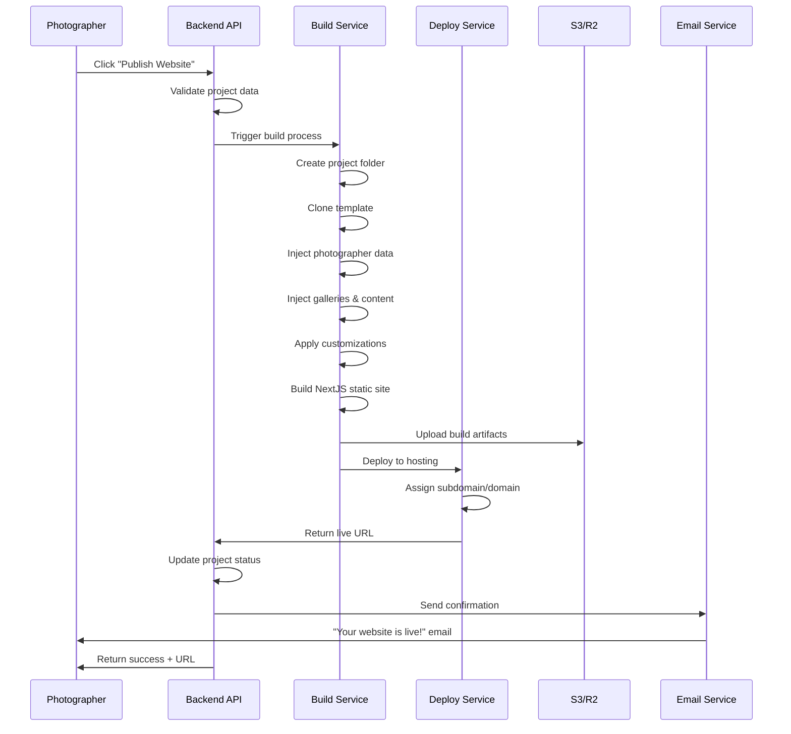
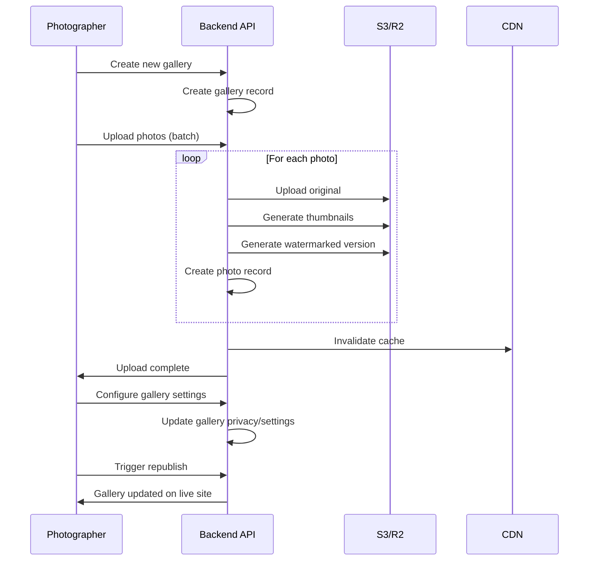
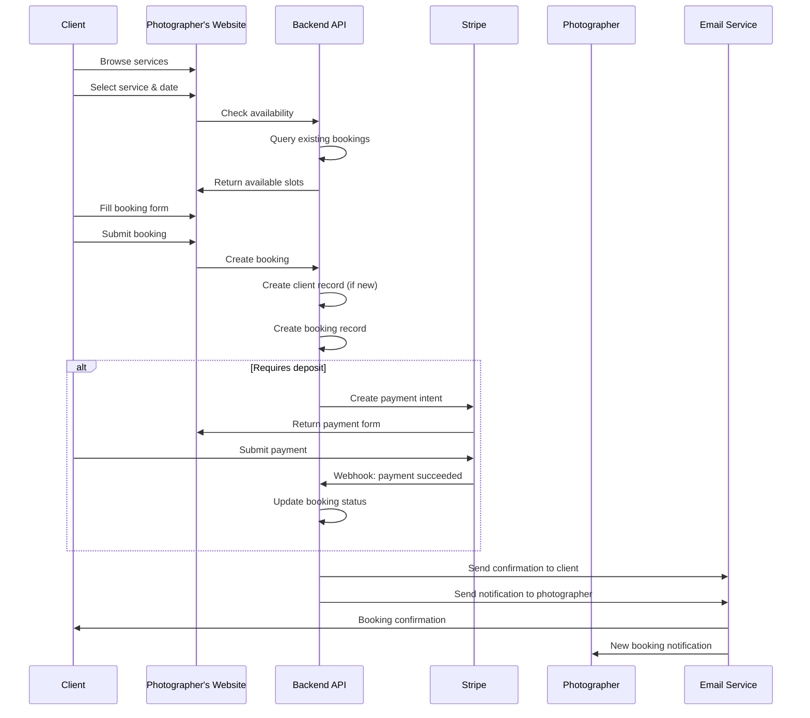
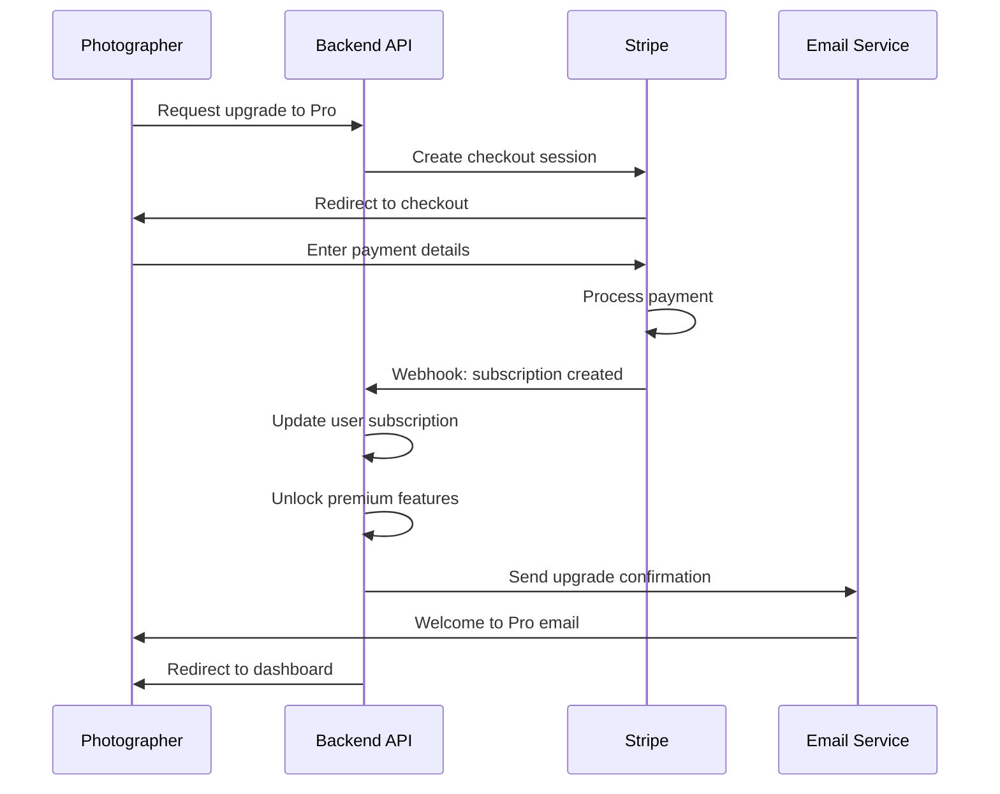
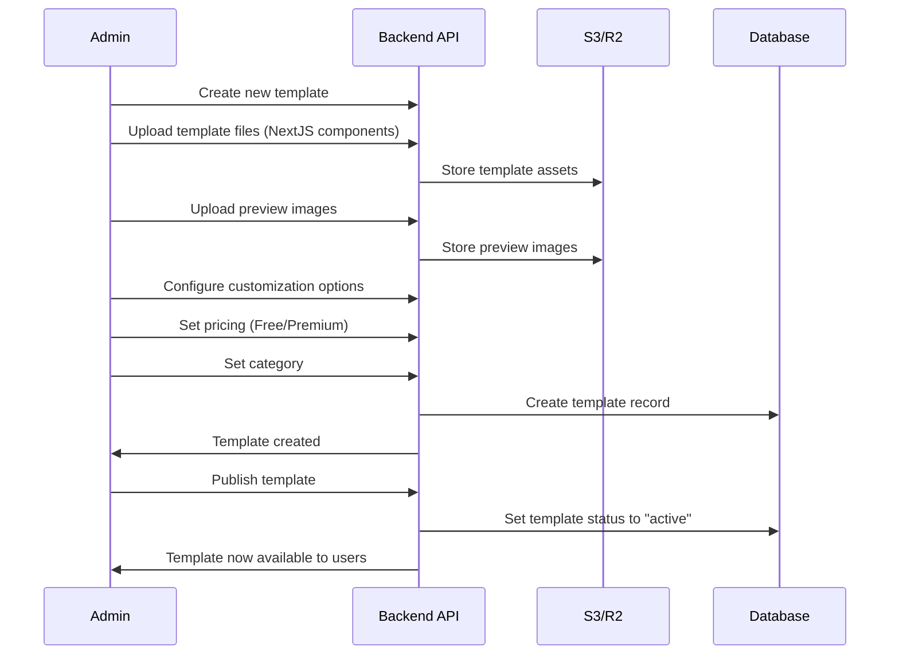

# Business Architecture - Pixieset-like SaaS Platform

## Executive Summary

This document outlines the business architecture for a production-grade SaaS platform that enables photographers to create, customize, and publish professional websites with integrated gallery management, client booking, and payment processing capabilities.

## 1. Core Business Model

### Value Proposition
- **For Photographers**: One-click professional website creation with zero technical knowledge required
- **For Clients**: Beautiful, fast-loading galleries and seamless booking experience
- **For Platform**: Recurring revenue through subscriptions and transaction fees

### Revenue Streams
1. **Subscription Tiers**
   - Free: Basic features, limited templates
   - Pro ($29/month): Premium templates, custom domain, advanced features
   - Studio ($99/month): White-label, priority support, unlimited everything

2. **Transaction Fees**
   - 3% on bookings for Free tier
   - 1.5% on bookings for Pro tier
   - 0% for Studio tier

3. **Premium Templates**
   - One-time purchase: $49-$199
   - Template bundles: $299-$499

## 2. System Roles & Permissions

### Role Hierarchy

### Role Definitions

#### Super Admin
**Purpose**: Platform owner with unrestricted access

**Capabilities**:
- Full system access
- Create/manage admins
- View all financial data
- System configuration
- Database management
- Audit log access

#### Admin
**Purpose**: Platform management and customer support

**Capabilities**:
- User management (view, edit, suspend, delete)
- Template marketplace management
- Subscription oversight
- Payment dispute resolution
- Employee management
- Website moderation and approval
- Analytics and reporting
- Customer support

**Restrictions**:
- Cannot delete Super Admin
- Cannot access system-level configurations

#### Employee
**Purpose**: Customer support and content moderation

**Capabilities**:
- View user information
- Assist with technical issues
- Template review and feedback
- Booking support
- Basic reporting

**Restrictions**:
- No financial data access
- Cannot modify subscriptions
- Cannot delete users
- Read-only access to most data

#### Photographer (Customer)
**Purpose**: End user creating and managing their website

**Capabilities**:
- Choose and customize templates
- Create and publish websites
- Manage galleries and photos
- Client management
- Booking management
- Payment processing
- Domain configuration
- Subscription management
- Analytics for their site

**Restrictions**:
- Access only to their own data
- Cannot access admin features
- Template customization within allowed parameters

## 3. Core Business Entities

### Entity Relationship Overview

### Entity Descriptions

#### User
Core entity representing all system users (admins, employees, photographers)
- Authentication credentials
- Profile information
- Role assignment
- Subscription status
- Created websites

#### Role
Defines permission levels and access control
- Role name (Super Admin, Admin, Employee, Photographer)
- Permission matrix
- Feature access flags

#### Template
Website design blueprints created by admins
- Template name and description
- Preview images
- Pricing (Free/Premium)
- Category (Portfolio, Wedding, Commercial, etc.)
- NextJS component structure
- Customization options
- Popularity metrics

#### WebsiteProject
Individual photographer's website instance
- Template reference
- Customization data (colors, fonts, layout)
- Publication status
- Domain/subdomain
- SEO settings
- Analytics data

#### Gallery
Photo collection within a website
- Gallery name and description
- Cover image
- Privacy settings (public, password-protected, client-only)
- Sort order
- Download permissions

#### Photo
Individual images within galleries
- Image URL (S3/R2)
- Metadata (EXIF data)
- Thumbnails
- Watermark settings
- Download count

#### Client
Photographer's customers
- Contact information
- Associated galleries
- Booking history
- Payment history
- Communication log

#### Booking
Appointment/session reservations
- Service type
- Date and time
- Location
- Status (pending, confirmed, completed, cancelled)
- Price
- Deposit information
- Notes

#### Subscription
Recurring payment plans
- Plan tier (Free, Pro, Studio)
- Billing cycle
- Status (active, cancelled, past_due)
- Stripe subscription ID
- Next billing date
- Feature entitlements

#### Payment
Transaction records
- Amount
- Type (subscription, booking, template purchase)
- Status (pending, completed, refunded)
- Stripe payment intent ID
- Invoice URL
- Timestamp

#### Domain
Custom domain configuration
- Domain name
- DNS verification status
- SSL certificate status
- Connected website project

#### Employee
Staff member information (extends User)
- Department
- Assigned responsibilities
- Performance metrics
- Access level

## 4. Core Business Processes

### 4.1 User Onboarding Flow

### 4.2 Template Selection & Customization

### 4.3 One-Click Website Publishing

### 4.4 Gallery Management

### 4.5 Client Booking Flow

### 4.6 Subscription Management

### 4.7 Admin Template Creation

## 5. Feature Matrix by Role

| Feature | Super Admin | Admin | Employee | Photographer |
|---------|-------------|-------|----------|--------------|
| **User Management** |
| View all users | ✅ | ✅ | ✅ (read-only) | ❌ |
| Edit users | ✅ | ✅ | ❌ | ❌ |
| Delete users | ✅ | ✅ | ❌ | ❌ |
| Suspend users | ✅ | ✅ | ❌ | ❌ |
| **Template Management** |
| Create templates | ✅ | ✅ | ❌ | ❌ |
| Edit templates | ✅ | ✅ | ❌ | ❌ |
| Delete templates | ✅ | ✅ | ❌ | ❌ |
| Set template pricing | ✅ | ✅ | ❌ | ❌ |
| Use templates | ✅ | ✅ | ❌ | ✅ |
| **Website Management** |
| Create website | ✅ | ✅ | ❌ | ✅ |
| Customize website | ✅ | ✅ | ❌ | ✅ (own only) |
| Publish website | ✅ | ✅ | ❌ | ✅ (own only) |
| Delete website | ✅ | ✅ | ❌ | ✅ (own only) |
| View all websites | ✅ | ✅ | ✅ | ❌ |
| **Gallery Management** |
| Create gallery | ✅ | ✅ | ❌ | ✅ (own only) |
| Upload photos | ✅ | ✅ | ❌ | ✅ (own only) |
| Delete photos | ✅ | ✅ | ❌ | ✅ (own only) |
| **Client & Booking** |
| View all bookings | ✅ | ✅ | ✅ | ❌ |
| Manage own bookings | ✅ | ✅ | ❌ | ✅ |
| Manage own clients | ✅ | ✅ | ❌ | ✅ |
| **Payments & Subscriptions** |
| View all payments | ✅ | ✅ | ❌ | ❌ |
| View own payments | ✅ | ✅ | ❌ | ✅ |
| Manage subscriptions | ✅ | ✅ | ❌ | ✅ (own only) |
| Issue refunds | ✅ | ✅ | ❌ | ❌ |
| **Domain Management** |
| Connect custom domain | ✅ | ✅ | ❌ | ✅ (Pro+) |
| Verify DNS | ✅ | ✅ | ❌ | ✅ (Pro+) |
| **Analytics** |
| Platform analytics | ✅ | ✅ | ❌ | ❌ |
| Own website analytics | ✅ | ✅ | ❌ | ✅ |
| **System** |
| System configuration | ✅ | ❌ | ❌ | ❌ |
| Audit logs | ✅ | ✅ | ❌ | ❌ |
| Employee management | ✅ | ✅ | ❌ | ❌ |

## 6. Subscription Tiers & Features

### Free Tier
**Price**: $0/month

**Features**:
- 1 website
- 3 galleries
- 100 photos total
- Basic templates only (5 templates)
- Subdomain only (username.ourplatform.com)
- Platform branding
- 3% transaction fee on bookings
- Email support (48hr response)
- 1GB storage

**Limitations**:
- No custom domain
- No premium templates
- Limited customization options
- Watermark on photos
- No analytics

### Pro Tier
**Price**: $29/month (billed monthly) or $290/year (save $58)

**Features**:
- 3 websites
- Unlimited galleries
- 10,000 photos
- All templates (50+ templates)
- Custom domain support
- Remove platform branding
- 1.5% transaction fee on bookings
- Priority email support (24hr response)
- 50GB storage
- Advanced customization
- Client proofing
- Basic analytics
- Password-protected galleries
- Download tracking

**Includes**:
- Free SSL certificate
- SEO tools
- Contact forms
- Social media integration

### Studio Tier
**Price**: $99/month (billed monthly) or $990/year (save $198)

**Features**:
- Unlimited websites
- Unlimited galleries
- Unlimited photos
- All templates + exclusive studio templates
- Multiple custom domains
- White-label (completely remove our branding)
- 0% transaction fee
- Priority phone + email support (4hr response)
- 500GB storage
- Advanced analytics & reporting
- Client management CRM
- Automated workflows
- API access
- Team collaboration (up to 5 users)
- Custom CSS/JS injection
- Advanced SEO tools
- Email marketing integration
- Booking calendar sync (Google, Apple)

**Premium Add-ons**:
- Additional team members: $10/user/month
- Extra storage: $5/50GB/month
- Priority build queue
- Dedicated account manager

## 7. Key Performance Indicators (KPIs)

### Business Metrics
- Monthly Recurring Revenue (MRR)
- Customer Acquisition Cost (CAC)
- Lifetime Value (LTV)
- Churn Rate
- Conversion Rate (Free → Paid)
- Average Revenue Per User (ARPU)

### Product Metrics
- Active websites published
- Average time to first publish
- Template usage distribution
- Photo upload volume
- Booking conversion rate
- Domain connection rate

### Technical Metrics
- Build success rate
- Average build time
- Deploy success rate
- API response time
- Uptime percentage
- Storage usage per user

## 8. Competitive Differentiation

### vs Pixieset
- **Our Advantage**: More affordable pricing, better template variety
- **Their Advantage**: Established brand, larger template marketplace

### vs Squarespace
- **Our Advantage**: Photography-specific features, better gallery management
- **Their Advantage**: More general-purpose, larger ecosystem

### vs Format
- **Our Advantage**: One-click deploy, better developer experience
- **Their Advantage**: More mature platform

### Unique Selling Points
1. **True One-Click Deploy**: No technical knowledge required
2. **Photography-First**: Built specifically for photographers
3. **Transparent Pricing**: No hidden fees
4. **Modern Tech Stack**: Fast, reliable, scalable
5. **Developer-Friendly**: API access for Studio tier

## 9. Risk Assessment & Mitigation

### Technical Risks
| Risk | Impact | Probability | Mitigation |
|------|--------|-------------|------------|
| Build failures | High | Medium | Robust error handling, rollback mechanism |
| Storage costs exceed projections | Medium | High | Implement compression, CDN, usage limits |
| Deploy service downtime | High | Low | Multi-region deployment, fallback systems |
| Database performance | High | Medium | Proper indexing, caching, read replicas |

### Business Risks
| Risk | Impact | Probability | Mitigation |
|------|--------|-------------|------------|
| Low conversion rate | High | Medium | Freemium model, compelling upgrade path |
| High churn | High | Medium | Excellent onboarding, customer success team |
| Stripe integration issues | High | Low | Thorough testing, webhook reliability |
| Legal/compliance | Medium | Low | Terms of service, privacy policy, GDPR compliance |

### Security Risks
| Risk | Impact | Probability | Mitigation |
|------|--------|-------------|------------|
| Data breach | Critical | Low | Encryption, regular audits, penetration testing |
| DDoS attacks | High | Medium | Rate limiting, CDN protection, WAF |
| Payment fraud | High | Medium | Stripe Radar, manual review for high-value |
| Account takeover | High | Medium | 2FA, OAuth, suspicious activity monitoring |

## 10. Success Criteria

### Launch (Month 1)
- ✅ Platform deployed and stable
- ✅ 100 beta users signed up
- ✅ 50 websites published
- ✅ 5 paying customers
- ✅ <1% build failure rate

### Growth (Month 3)
- ✅ 1,000 registered users
- ✅ 500 published websites
- ✅ 100 paying customers
- ✅ $5,000 MRR
- ✅ <2% churn rate

### Scale (Month 6)
- ✅ 5,000 registered users
- ✅ 2,000 published websites
- ✅ 500 paying customers
- ✅ $25,000 MRR
- ✅ 99.9% uptime
- ✅ <5% churn rate

### Maturity (Month 12)
- ✅ 20,000 registered users
- ✅ 10,000 published websites
- ✅ 2,000 paying customers
- ✅ $100,000 MRR
- ✅ 99.95% uptime
- ✅ <3% churn rate
- ✅ Break-even or profitable

---

**Document Version**: 1.0  
**Last Updated**: 2025-12-29  
**Authors**: Product Manager + Engineering Team
